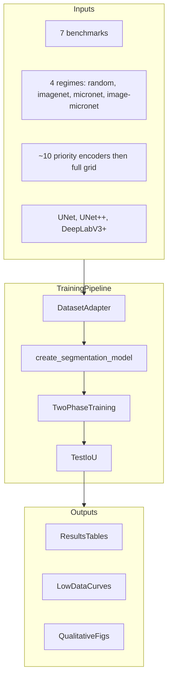
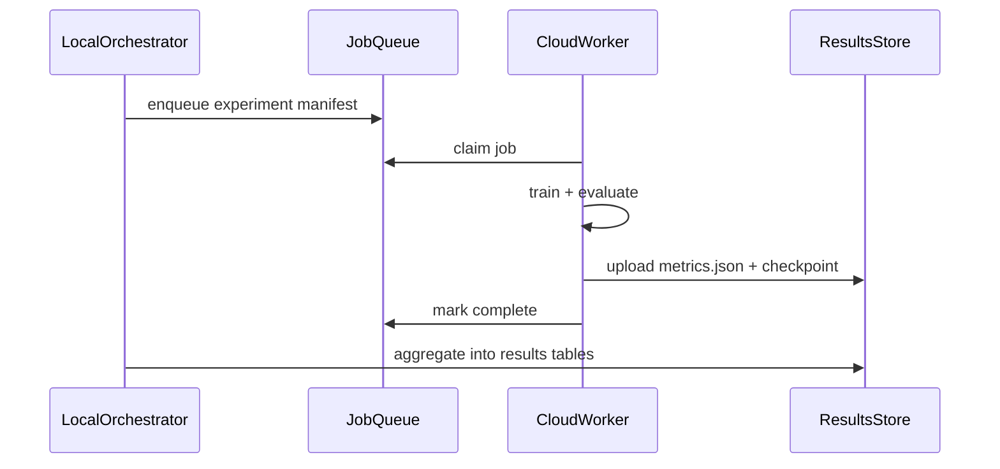

# MicroNet Paper Reproduction — Sprint Plan

**Paper:** [Microstructure segmentation with deep learning encoders pre-trained on a large microscopy dataset](https://www.nature.com/articles/s41524-022-00878-5) (Stuckner et al., 2022)

**Primary repo:** [nasa/pretrained-microscopy-models](https://github.com/nasa/pretrained-microscopy-models)

**Scope:** Benchmark reproduction + ablations (low-data sweeps, encoder/architecture/pretraining comparisons, statistical analysis). Cloud GPUs for scaling.

**Out of scope (unless you later obtain data):** Retraining MicroNet classification on the ~100k-image / 54-class dataset — **not publicly released** (see availability audit below). Reproduction uses released **MicroNet v1.0** encoder weights (explicitly marked as the paper version in the [README](https://github.com/nasa/pretrained-microscopy-models)).

---

## Dataset availability audit (verified 2026-06-24)

Live checks confirmed what is public, downloadable, and sufficient for reproduction.

| Dataset / asset | Public? | Access verified? | Notes |
|---|---|---|---|
| **Super1–Super4** (Ni-superalloy benchmarks) | Yes | Yes (Super1 sampled) | MIT license. ~104 images + masks in [`benchmark_segmentation_data/`](https://github.com/nasa/pretrained-microscopy-models/tree/main/benchmark_segmentation_data). Served as raw TIFF via GitHub — **not Git LFS pointers**. |
| **EBC1–EBC3** (environmental barrier coating benchmarks) | Yes | Yes (EBC1, EBC3 sampled) | Same repo path. Grayscale masks; image/mask filenames match (not `_mask.tif` suffix). |
| **MicroNet classification dataset** (~100k images, 54 classes) | **No** | N/A | Described in paper/NASA TM but **not hosted** in the GitHub repo. README [Box link](https://nasagov.app.box.com/f/f505f4652ffc4a1788e630282c5f8e58) is for *contributing* micrographs, not downloading the training set. |
| **Pretrained encoder weights** (v1.0 / v1.1) | Yes | Yes | NASA S3 (`nasa-public-data.s3.amazonaws.com/microscopy_segmentation_models/`) returns HTTP 200 for sampled encoders. Also mirrored on [HuggingFace `jstuckner`](https://huggingface.co/jstuckner) (66 models). |
| **ImageNet pretraining** | Yes | Yes (standard) | Via `torchvision` / `segmentation_models_pytorch` — no special access needed. |
| **Instance segmentation demo** (Sprint 6) | Yes | Yes | COCO annotations + PNG tiles in [`instance_segmentation/data/`](https://github.com/nasa/pretrained-microscopy-models/tree/main/instance_segmentation/data). Sample PNG downloaded (230 KB). |

**Bottom line:** All **downstream segmentation benchmarks** needed for the paper's core claims are public and accessible. The **upstream MicroNet pretraining corpus** is not — reproduction must use released weights, not retrain encoders from scratch.

**Download method (Sprint 0):** `git clone` or sparse checkout of `benchmark_segmentation_data/` from the public NASA repo. Git LFS is **not required** (no `.gitattributes` in repo; files download as real TIFF/PNG blobs).

---

## What the paper claims vs. what we can reproduce

| Paper component | Available in repo | Reproduction approach |
|---|---|---|
| MicroNet encoder pretraining | Pretrained weights only (v1.0 + v1.1) | Load v1.0 weights via `pmm.util.get_pretrained_microscopynet_url(..., version=1.0)` |
| Segmentation training | `segmentation_training.py`, example notebooks | Port notebook flow to config-driven scripts |
| 7 benchmark datasets | `benchmark_segmentation_data/{Super1-4, EBC1-3}` | `git clone` / sparse checkout; validate splits (~220 TIFF files total) |
| Pretraining regimes | `imagenet`, `micronet`, `image-micronet`, random init | `create_segmentation_model()` |
| Architectures | UNet, UNet++, DeepLabV3+ via `segmentation_models_pytorch` | Paper highlights UNet + DeepLabV3+ |
| Low-data regime | Super3 has **1** training image | Subsample training sets + Super3 |
| Instance segmentation | `instance_segmentation/` (MMDetection) | Optional Sprint 6 |

**Critical reproduction pitfall:** [`util.py`](https://github.com/nasa/pretrained-microscopy-models/blob/main/pretrained_microscopy_models/util.py) defaults to **MicroNet v1.1** for `resnet50/micronet`. Paper reproduction must pin **`version=1.0`** everywhere.

---

## Benchmark dataset inventory

| Dataset | Task | Train / Val / Test | Notes |
|---|---|---|---|
| Super1 | 3-class (matrix, secondary, tertiary) | 10 / 4 / 4 | RGB masks `[0,0,0]`, `[255,0,0]`, `[0,0,255]` |
| Super2 | 3-class | 4 / 4 / 4 | Same mask convention |
| Super3 | 3-class | **1** / 4 / 4 | Key low-data benchmark |
| Super4 | 3-class | 4 / 4 / 5 | Same mask convention |
| EBC1 | Binary oxide | 18 / 3 / 3 | Grayscale masks (0=bg, 1=oxide, 2=crack); custom filename pairing |
| EBC2 | Binary oxide | 4 / 3 / 3 | Same |
| EBC3 | Binary oxide | 15 / 3 / 6 | Same |

Data layout per dataset: `train`, `train_annot`, `val`, `val_annot`, `test`, `test_annot`.

---

## Target experiment matrix (cloud-parallel)



**Phase 1 (representative):** 7 datasets × 4 pretraining × 2 encoders (`resnet50`, `se_resnext50_32x4d`) × `UnetPlusPlus` ≈ **56 runs**

**Phase 2 (architecture ablation):** Top 3 datasets × 4 pretraining × 2 encoders × 3 architectures ≈ **72 runs**

**Phase 3 (encoder sweep):** Paper's high-accuracy encoders (e.g. `inceptionv4`, `xception`, `senet154`, `efficientnet-b4`) on full matrix

**Low-data ablation:** For each Super dataset, subsample training to {1, 2, 4, 8, all} images × 4 pretraining regimes

**Seeds:** 3–5 random seeds for primary comparisons; report mean ± std

---

## Hyperparameters (from repo notebooks + `segmentation_training.py`)

Match the official examples before deviating:

- **Optimizer:** Adam, `lr=2e-4`, `lr_decay=0` (decay applied manually between phases)
- **Early stopping:** `patience=30` on validation IoU
- **Two-phase schedule:** Phase 1 at `2e-4` until patience stop → Phase 2 resume at `1e-5`
- **Loss:** `DiceBCELoss(weight=0.7)`
- **Metric:** `IoU(threshold=0.5)` (per-class + mean)
- **Batch size:** 6 (adjust per GPU memory)
- **Preprocessing:** ImageNet normalization even for MicroNet encoders (per notebooks)
- **Augmentation:** Super = flip/rotate/CLAHE/noise; EBC = horizontal flip + random 512 crop + dataset-specific val crop
- **Inference:** Patch size 512, stride 256 via `segmentation_models_inference()`

---

## Proposed project structure

```
amat/
├── pyproject.toml / requirements.txt   # pin torch==1.10.1, smp==0.2.1 from NASA frozen env
├── configs/
│   ├── datasets/                       # super1.yaml, ebc1.yaml, ...
│   ├── experiments/                    # baseline, low_data, sweep
│   └── cloud/                          # job templates (RunPod, Lambda, GCP)
├── src/amat/
│   ├── data/                           # DatasetAdapter (Super vs EBC mask logic)
│   ├── models/                         # wrapper around pmm.create_segmentation_model
│   ├── train/                          # two-phase trainer, early stopping
│   ├── eval/                           # IoU, patch inference, visualization
│   └── orchestration/                  # experiment matrix generator, cloud launcher
├── scripts/
│   ├── download_data.sh
│   ├── train.py
│   ├── evaluate.py
│   └── run_matrix.py
├── results/                            # gitignored; CSV + checkpoints
└── paper/                              # manually transcribed target tables from PDF
```

**Dependency strategy:** `pip install git+https://github.com/nasa/pretrained-microscopy-models` plus a thin local wrapper. Vendor or fork only if you need to patch `version=1.0` defaults globally.

---

## Sprint breakdown (6 sprints, ~2 weeks each)

### Sprint 0 — Foundation and smoke test (Week 1)

**Goal:** Runnable environment that reproduces one notebook result end-to-end.

- Initialize git repo, Python 3.8+ env, CUDA PyTorch matching [requirements_frozen.txt](https://github.com/nasa/pretrained-microscopy-models/blob/main/requirements_frozen.txt)
- Clone benchmark data (sparse checkout of `benchmark_segmentation_data/` — no Git LFS needed)
- Verify pretrained weight download from NASA S3 for `resnet50` + `se_resnext50_32x4d` with **`version=1.0`**
- Run reference configs:
  - Super1: `UnetPlusPlus` + `resnet50` + `micronet` (multiclass notebook)
  - EBC1: `UnetPlusPlus` + `se_resnext50_32x4d` + `micronet` (binary notebook)
- **Exit criteria:** Test IoU within ~2–5% of a manually recorded notebook baseline; training loss curves same shape

### Sprint 1 — Production training pipeline (Weeks 2–3)

**Goal:** Replace notebooks with reproducible CLI.

- Implement `DatasetAdapter` handling:
  - Super: auto `_mask.tif` pairing via [`io.py`](https://github.com/nasa/pretrained-microscopy-models/blob/main/pretrained_microscopy_models/io.py)
  - EBC: explicit image/mask path lists; grayscale class values `{oxide: [1]}`
- Config-driven experiment definitions (YAML): dataset, encoder, architecture, pretraining, augmentation profile
- Port two-phase training from [`segmentation_training.py`](https://github.com/nasa/pretrained-microscopy-models/blob/main/pretrained_microscopy_models/segmentation_training.py) with checkpoint resume
- Add structured logging (WandB or MLflow): train/val loss, IoU per epoch, hyperparams, git SHA
- **Exit criteria:** `python scripts/train.py --config configs/experiments/super1_baseline.yaml` produces checkpoint + metrics JSON

### Sprint 2 — Core benchmark matrix (Weeks 4–5)

**Goal:** Reproduce the paper's central comparison — MicroNet vs ImageNet pretraining across all 7 datasets.

- Run 7 datasets × 4 pretraining regimes × `UnetPlusPlus` × 2 encoders (56 jobs on cloud)
- Implement `scripts/evaluate.py` with held-out test IoU (per-class + mean)
- Build `scripts/run_matrix.py` to generate job manifests and dispatch to cloud (parallel workers)
- Transcribe paper Tables 2–4 (from PDF) into `paper/target_metrics.csv` for comparison
- **Exit criteria:** Results table showing MicroNet ≥ ImageNet on majority of datasets; document any >5% gaps with hypothesis (seed, augmentation, v1.0 weight mismatch)

### Sprint 3 — Low-data ablations (Weeks 6–7)

**Goal:** Reproduce the paper's headline low-data finding (72.2% relative IoU error reduction with 1 training image).

- Super3 full experiment (1 training image)
- Subsampled training curves: {1, 2, 4, 8, max} images per Super dataset
- Compute **relative IoU error reduction**: `(IoU_imagenet - IoU_micronet) / (1 - IoU_imagenet)` or paper's exact formula (verify from PDF Methods)
- Plot IoU vs # training images for each pretraining regime
- **Exit criteria:** Super3 shows substantial MicroNet advantage; curve monotonicity with more data

### Sprint 4 — Architecture and encoder sweep (Weeks 8–10)

**Goal:** Full ablation matrix with statistical rigor.

- Add `Unet` and `DeepLabV3Plus` architectures (handle encoders that don't support dilation per `create_segmentation_model` error handling)
- Priority encoder list from README v1.0 top performers: `inceptionv4`, `xception`, `senet154`, `se_resnext50_32x4d`, `efficientnet-b4`, `resnet50`
- 3–5 seeds for primary dataset × pretraining comparisons
- Cloud autoscaling: queue-based worker pool, spot/preemptible instances with checkpoint resume
- **Exit criteria:** Mean ± std tables; identify best encoder/architecture per dataset class (Super vs EBC)

### Sprint 5 — Validation, figures, and reproduction report (Weeks 11–12)

**Goal:** Publication-quality comparison to paper.

- Patch-based full-image inference on test set (not just dataloader crops)
- Qualitative figures: prediction overlays, error maps via `visualize_prediction_accuracy()`
- Aggregate results into paper-style tables and Fig 1-like panels
- Write reproduction report: matched results, unexplained gaps, env versions, known limitations
- **Exit criteria:** Side-by-side table with paper targets; clear pass/partial/fail per experiment

### Sprint 6 (Optional) — Instance segmentation and extensions (Weeks 13–14)

- Port [`instance_segmentation/`](https://github.com/nasa/pretrained-microscopy-models/tree/main/instance_segmentation) MMDetection Mask R-CNN example
- Feature extraction / clustering notebook (`unsupervised-extract-features-example.ipynb`)
- Only if core benchmarks are validated

---

## Cloud orchestration pattern



- Store checkpoints and metrics on cloud object storage (S3/GCS), not in git
- Each job is self-contained: config YAML + data path + seed
- Use preemptible instances; rely on `checkpoint.pth.tar` resume from Sprint 1

---

## Risk register

| Risk | Mitigation |
|---|---|
| MicroNet v1.1 used by default | Force `version=1.0` in all weight URLs |
| Dependency drift (old torch/smp) | Docker image pinned to NASA frozen env; test on clean VM |
| EBC mask naming differs from Super | Separate dataset config profiles |
| Paper hyperparams differ per dataset | Start from notebooks; document overrides in config |
| Large experiment matrix cost | Phase 1 representative runs before full sweep |
| Cannot access Nature PDF tables | Manually transcribe Tables 2–4 in Sprint 2 |
| MicroNet classification images unavailable | Use released v1.0 encoder weights; do not attempt full pretraining reproduction |

---

## Recommended execution order

1. Sprint 0 smoke test (de-risks environment)
2. Sprint 1 pipeline (unblocks all parallel work)
3. Sprint 2 core matrix (validates main paper claim early)
4. Sprint 3 low-data (headline result)
5. Sprint 4 full sweep (cloud spend)
6. Sprint 5 report

Estimated calendar time: **~12 weeks** for Sprints 0–5; add 2 weeks for optional Sprint 6.

## Todos

Tracked as GitHub issues under milestone [MicroNet Paper Reproduction](https://github.com/tyc-aidev/microscopy-analysis/milestone/1).

- [ ] [#8 Dataset Explorer](https://github.com/tyc-aidev/microscopy-analysis/issues/8) — Streamlit visualization app (pre-Sprint-0, see [PLAN_DATASET_EXPLORER.md](PLAN_DATASET_EXPLORER.md))
- [ ] [#1 Sprint 0](https://github.com/tyc-aidev/microscopy-analysis/issues/1) — Foundation and smoke test
- [ ] [#2 Sprint 1](https://github.com/tyc-aidev/microscopy-analysis/issues/2) — Production training pipeline
- [ ] [#3 Sprint 2](https://github.com/tyc-aidev/microscopy-analysis/issues/3) — Core benchmark matrix
- [ ] [#4 Sprint 3](https://github.com/tyc-aidev/microscopy-analysis/issues/4) — Low-data ablations
- [ ] [#5 Sprint 4](https://github.com/tyc-aidev/microscopy-analysis/issues/5) — Architecture and encoder sweep
- [ ] [#6 Sprint 5](https://github.com/tyc-aidev/microscopy-analysis/issues/6) — Validation, figures, and reproduction report
- [ ] [#7 Sprint 6](https://github.com/tyc-aidev/microscopy-analysis/issues/7) — Instance segmentation and extensions (optional)