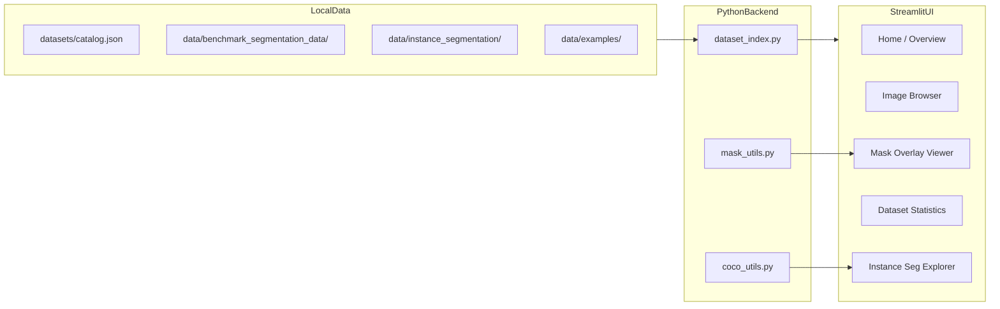
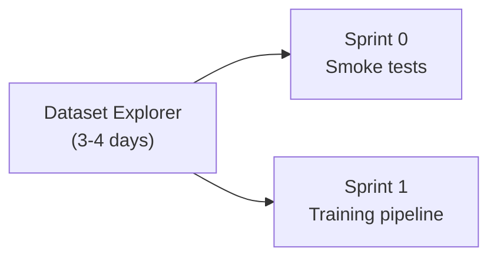

# Dataset Explorer — Local Web App Plan

A **separate pre-Sprint-0 workstream** to understand the public datasets before training. Lives alongside the main reproduction plan in [PLAN.md](PLAN.md).

**Stack:** Streamlit  
**Scope:** All small public assets — benchmarks + instance segmentation demo + NASA example images  
**Explicitly excluded:** MicroNet ~100k classification pretraining corpus (not public)

---

## Datasets to cover

### 1. Semantic segmentation benchmarks (`benchmark_segmentation_data/`)

~293 TIFF files total across 7 datasets. Each has `train`, `train_annot`, `val`, `val_annot`, `test`, `test_annot` folders. **Super2 and Super3 also have `different_test` splits** (not documented in the original reproduction plan — the explorer should surface these).

| Dataset | Material | Classes | Mask format | Pairing rule |
|---------|----------|---------|-------------|--------------|
| Super1–4 | Ni-based superalloy | matrix, secondary γ′, tertiary γ′ | RGB TIFF | `image.tif` ↔ `image_mask.tif` |
| EBC1–3 | Environmental barrier coating | background, oxide, crack (crack often ignored in binary task) | Grayscale TIFF (0/1/2) | Same filename in `train` and `train_annot` |

**Class colors (Super):** `[0,0,0]` matrix, `[255,0,0]` secondary, `[0,0,255]` tertiary  
**Class values (EBC):** `0` background, `1` oxide, `2` crack

**Updated split counts** (from GitHub tree, June 2026):

| Dataset | train | val | test | different_test |
|---------|-------|-----|------|----------------|
| Super1 | 10 | 4 | 4 | — |
| Super2 | 4 | 4 | 4 | 4 |
| Super3 | **2** | 4 | 4 | 4 |
| Super4 | 4 | 4 | 5 | — |
| EBC1 | 18 | 3 | 3 | — |
| EBC2 | 4 | 3 | 3 | — |
| EBC3 | 15 | 3 | 6 | — |

### 2. Instance segmentation demo (`instance_segmentation/data/`)

~230 PNG tiles (512×512) + COCO JSON annotations (`train.json`, `validation.json`). Single class: **melt pool**. Used in NASA's MMDetection Mask R-CNN example.

### 3. Example / reference assets (`examples/`)

Small set of non-benchmark images useful for context:

- `npg.png` — microscopy sample used in classification notebook
- `dog.jpeg` — ImageNet comparison image
- `regression-and-xai/sample_heatmaps/` — XAI demo outputs
- `instance_segmentation/predictions/` — pretrained model prediction comparisons (ImageNet vs MicroNet)

---

## App architecture



**Design principles:**
- Read-only — no training, no writes to annotations
- Data path configurable via env var `DATA_ROOT` (default `./data`)
- On first run, prompt user to download data if missing
- Cache image thumbnails and stats with `@st.cache_data`

---

## Proposed file layout

```
microscopy-analysis/
├── PLAN_DATASET_EXPLORER.md          # this plan
├── explorer/
│   ├── app.py                        # Streamlit entry point
│   ├── pages/
│   │   ├── 1_Benchmarks.py
│   │   ├── 2_Instance_Segmentation.py
│   │   └── 3_Examples.py
│   ├── lib/
│   │   ├── catalog.py                # load datasets/catalog.json
│   │   ├── index.py                  # scan DATA_ROOT, build file index
│   │   ├── masks.py                  # Super RGB + EBC grayscale → colored overlay
│   │   └── coco.py                   # parse COCO JSON, draw bboxes/masks
│   └── datasets/
│       └── catalog.json              # human-readable dataset metadata
├── scripts/
│   └── download_data.sh              # sparse clone of NASA benchmark + instance + examples
└── data/                             # gitignored, downloaded locally
```

**Run command:** `streamlit run explorer/app.py` (localhost:8501)

---

## UI pages (Streamlit)

### Home — Overview
- Project context: what each dataset family is for in the paper
- Card per dataset with: material type, task, # images, splits, license (MIT)
- Link to paper, NASA repo, and main [PLAN.md](PLAN.md)
- Data download status indicator (green if `DATA_ROOT` populated)

### Page 1 — Semantic Benchmarks
- **Sidebar filters:** dataset (Super1–4 / EBC1–3), split (train/val/test/different_test), class visibility toggles
- **Main panel:** image + mask overlay (opacity slider)
- **Toggle views:** original | mask only | overlay | side-by-side
- **Per-image metadata:** filename, dimensions, class pixel counts (%)
- **Dataset info panel:** explain Ni-superalloy vs EBC, note EBC binary task ignores cracks, note Super3 low-data regime

### Page 2 — Instance Segmentation
- Browse PNG tiles from train / validation
- Overlay COCO bounding boxes and segmentation polygons for melt pool
- Summary stats: # images, # annotations, bbox size distribution

### Page 3 — Examples and Reference Assets
- Gallery of `npg.png`, `dog.jpeg`, XAI heatmaps, prediction comparison images
- Short captions explaining each asset's role in NASA notebooks

### Cross-cutting — Statistics tab (or expander on Home)
- Bar chart: images per dataset × split
- Pie chart: class pixel distribution per dataset (aggregated over split)
- Table: highlight Super3 (2 train images) and `different_test` splits

---

## `catalog.json` structure (curated explanations)

Static metadata file the app loads — keeps prose out of Python code:

```json
{
  "families": [
    {
      "id": "super",
      "name": "Ni-based Superalloys",
      "paper_ref": "Super 1-4",
      "description": "SEM micrographs of γ/γ′ microstructure...",
      "datasets": ["Super1", "Super2", "Super3", "Super4"],
      "classes": [
        {"id": "matrix", "color": [0,0,0]},
        {"id": "secondary", "color": [255,0,0]},
        {"id": "tertiary", "color": [0,0,255]}
      ]
    }
  ]
}
```

---

## Data download script

Sparse-checkout from NASA repo:

```bash
git clone --depth 1 --filter=blob:none --sparse \
  https://github.com/nasa/pretrained-microscopy-models.git data/_upstream
cd data/_upstream && git sparse-checkout set \
  benchmark_segmentation_data instance_segmentation/data examples
```

No Git LFS required (verified in [PLAN.md](PLAN.md) audit).

---

## Implementation phases (~3–4 days)

### Phase 1 — Data plumbing (Day 1)
- Create `scripts/download_data.sh`
- Write `explorer/datasets/catalog.json` with all dataset descriptions
- Implement `explorer/lib/index.py` — scan folders, pair images↔masks, handle both naming conventions
- Implement `explorer/lib/masks.py` — RGB and grayscale mask → colored RGBA overlay

### Phase 2 — Core Streamlit UI (Day 2)
- `explorer/app.py` home page with overview cards and download prompt
- `pages/1_Benchmarks.py` — browser + overlay viewer with filters
- Basic stats: image count per split, displayed in sidebar

### Phase 3 — Instance seg + examples (Day 3)
- `explorer/lib/coco.py` — load COCO JSON, match image IDs to PNG paths
- `pages/2_Instance_Segmentation.py` — tile browser with polygon overlay
- `pages/3_Examples.py` — static gallery

### Phase 4 — Polish + integration (Day 4)
- Aggregate statistics charts on Home page
- Add `requirements-explorer.txt` (`streamlit`, `pillow`, `numpy`, `matplotlib`, `pandas`)
- Update [README.md](README.md) with explorer instructions

---

## Dependencies

Minimal, separate from the heavy ML stack (Sprint 0):

```
streamlit>=1.30
pillow>=9.0
numpy>=1.22
matplotlib>=3.5
pandas>=1.4
```

No PyTorch required for the explorer — keeps it lightweight and runnable before CUDA env setup.

---

## Relationship to Sprint 0



The explorer de-risks Sprint 0 by confirming:
- Data downloads correctly
- Mask pairing logic matches NASA `io.py` conventions
- Super vs EBC preprocessing differences are understood visually
- `different_test` splits on Super2/3 are discovered before benchmarking

---

## Exit criteria

- `streamlit run explorer/app.py` launches locally with no errors
- All 7 benchmark datasets browsable with correct mask overlays
- Instance segmentation tiles show COCO melt-pool annotations
- Example assets gallery renders with captions
- Home page shows accurate per-split image counts
- README documents how to download data and start the app

## GitHub tracking

Tracked in [#8 Dataset Explorer](https://github.com/tyc-aidev/microscopy-analysis/issues/8), to run before [#1 Sprint 0](https://github.com/tyc-aidev/microscopy-analysis/issues/1).

## Todos

- [ ] **explorer-data-script** — Create scripts/download_data.sh and explorer/datasets/catalog.json with curated dataset metadata
- [ ] **explorer-lib** — Implement explorer/lib/ (index.py, masks.py, coco.py) for file pairing and mask overlay rendering
- [ ] **explorer-streamlit-core** — Build app.py home page + pages/1_Benchmarks.py with filterable image/mask overlay viewer
- [ ] **explorer-streamlit-ext** — Add pages/2_Instance_Segmentation.py and pages/3_Examples.py
- [ ] **explorer-polish** — Add statistics charts, requirements-explorer.txt, README section