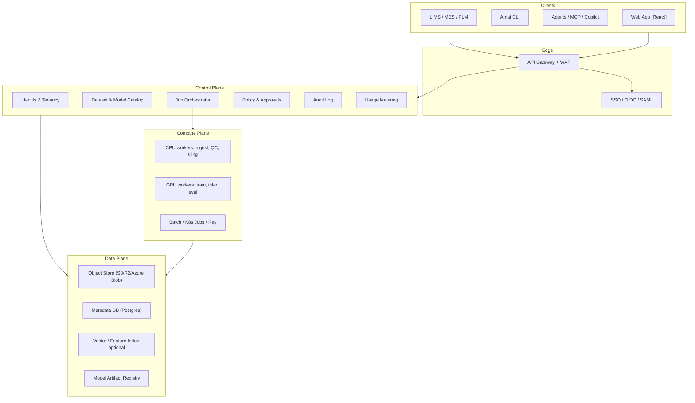
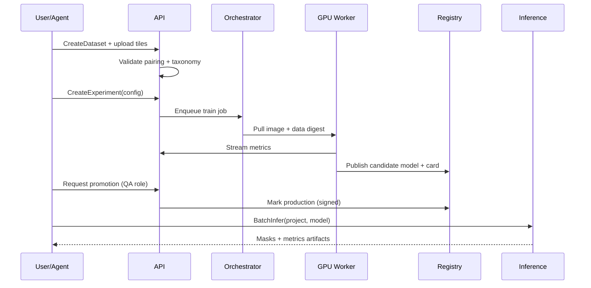

# Amat — Enterprise Microscopy Analysis SaaS

**Status:** Design (pre-implementation)  
**Base capability:** This repo’s Dataset Explorer + MicroNet segmentation pipeline  
**Audience:** Materials labs, aerospace OEMs, semiconductor FA, battery / alloy R&D, contract microscopy houses

---

## 1. Product thesis

Turn the current research monorepo (browse NASA benchmarks → train MicroNet-backed segmenters → inspect IoU / overlays) into a **multi-tenant, enterprise-deployable platform** for production microscopy computer vision:

| Today (repo) | Target (SaaS) |
|---|---|
| Local TIFF folders + Streamlit | Tenant-isolated object storage + web app |
| YAML configs + CLI `train.py` | Job API, queues, GPU pools, experiment registry |
| Single-user results under `results/` | Org workspaces, RBAC, audit trail, signed model artifacts |
| Human-driven notebooks/UI | Agent-native tools, MCP, policy-gated copilots |

**Working name:** **Amat** (Advanced Materials Analysis Technology)  
**Tagline:** Microscopy segmentation that ships into the lab, not just the paper.

---

## 2. Design principles

1. **Domain-first, not dashboard-first** — First screen is the micrograph and the mask, not a KPI grid.
2. **Reproducibility as a product feature** — Every run pins encoder version, seed, data digest, container digest (learn from MicroNet v1.0 vs v1.1 pitfall).
3. **Agent-native by default** — Every user action has an equivalent tool + API; agents never scrape the UI.
4. **Enterprise integration before fancy ML** — SSO, VPC, audit, LIMS hooks land before exotic architectures.
5. **Separation of concerns** — Data plane ≠ control plane ≠ inference plane; Streamlit stays a prototype surface only.

---

## 3. Personas & jobs

| Persona | Primary job | Success signal |
|---|---|---|
| **Materials scientist** | Segment γ′ / oxide / crack; compare models | Trusted overlays + IoU on hold-out |
| **Lab ops engineer** | Ingest instrument dumps; keep queues healthy | SLA on job latency, storage quotas |
| **ML engineer** | Fine-tune encoders; sweep ablations | Experiment matrix with mean±std |
| **QA / metrology** | Approve model for production line | Signed model card + gate checklist |
| **IT / security** | SSO, residency, audit | SOC2 controls map 1:1 to features |
| **Agent / automation** | Run pipelines via tools | Deterministic tool schemas + idempotent jobs |

---

## 4. Platform architecture

### 4.1 Logical planes



### 4.2 Deployment topologies (enterprise-ready)

| Mode | Who runs it | When to use |
|---|---|---|
| **Multi-tenant SaaS** | Amat cloud | Mid-market labs, non-ITAR |
| **Dedicated VPC (BYOC)** | Customer cloud, Amat operators | Large OEMs, data residency |
| **Air-gapped appliance** | Customer only | Defense / classified / no egress |
| **Hybrid** | Control plane SaaS + GPU on-prem | Instruments stay on campus |

**Hard requirement for big enterprise:** same APIs and UI in all modes; only the control-plane trust boundary changes.

### 4.3 Tenancy model

```
Organization
  └── Workspace (lab / program / site)
        ├── Projects
        │     ├── Datasets (versioned)
        │     ├── Experiments / Runs
        │     ├── Models (staged: draft → candidate → production)
        │     └── Inference endpoints / batch jobs
        └── Members + Roles + Agent identities
```

- **Row-level isolation** in Postgres via `org_id` / `workspace_id`.
- **Bucket prefixes or separate buckets** per org; optional CMEK.
- **Agent identities** are first-class principals (not shared service accounts).

---

## 5. Module map

Map from today’s code → SaaS modules.

| Module | Responsibility | Evolves from |
|---|---|---|
| **Ingest & Catalog** | Upload, instrument connectors, TIFF/PNG/COCO indexing, split rules, class taxonomy | `explorer/lib/{index,catalog,coco,masks}.py` |
| **Viewer / Annotation** | Overlay viewer, class palette, weak-label assist, review queues | Streamlit Benchmarks / Instance pages |
| **Dataset QC** | Pixel histograms, split imbalance, mask pairing validation (Super `_mask.tif` vs EBC same-name) | `explorer/lib/stats.py`, adapters |
| **Training Studio** | Config-driven train (2-phase Adam, DiceBCE, early stop), matrix sweeps | `src/microscopy_analysis/train/*`, `orchestration/*` |
| **Model Registry** | Weights, cards, encoder pin (MicroNet v1.0), lineage, promotion gates | `models/{factory,weights}.py` + checkpoints |
| **Evaluation** | IoU@0.5, per-class metrics, qualitative panels, paper target compare | `eval/*`, `paper/target_metrics.csv` |
| **Inference Service** | Patch inference (512/256), batch, streaming, on-prem edge | `eval/predictions.py` |
| **Orchestration** | Queues, retries, GPU scheduling, experiment matrix | `orchestration/matrix.py` |
| **Integrations** | REST/gRPC, webhooks, LIMS adapters, SSO | New |
| **Agent Runtime** | Tool registry, MCP server, policy sandbox, run transcripts | New |
| **Admin / Compliance** | RBAC, audit, retention, residency, BYOK | New |

### 5.1 Service boundaries (recommended packages)

```
apps/
  web/                 # Enterprise UI (React)
  api/                 # Public HTTP + OpenAPI
  worker-cpu/
  worker-gpu/
  agent-gateway/       # MCP + tool auth
packages/
  domain/              # Datasets, masks, metrics (pure Python — keep from src/)
  ml-runtime/          # torch/smp wrappers
  policy/              # RBAC + approval rules
  sdks/
    python/
    typescript/
infra/
  terraform/
  helm/
```

Keep **domain logic framework-agnostic** so Streamlit can remain a thin internal prototype while the product UI moves to React.

---

## 6. Core domain flows

### 6.1 Ingest → Train → Promote → Infer



### 6.2 Config contract (enterprise-safe evolution of YAML)

Preserve today’s knobs (`encoder`, `architecture`, `pretraining`, `micronet_version`, phase LRs, patience) but store as versioned JSON Schema:

- Immutable `ExperimentSpec` after launch
- `DataDigest` (content-addressed) required before train
- `RuntimeDigest` (container + CUDA/driver) recorded on completion
- Fail closed if `micronet_version != requested`

---

## 7. Enterprise-ready UI

### 7.1 Information architecture

```
Amat
├── Home (workspace continuum — not a KPI dashboard)
├── Library
│   ├── Datasets
│   ├── Images / Tiles
│   └── Taxonomies
├── Studio
│   ├── Annotate / Review
│   ├── Train
│   ├── Experiments
│   └── Compare
├── Models
│   ├── Registry
│   ├── Cards & Gates
│   └── Endpoints
├── Inference
│   ├── Batch jobs
│   └── Live / Edge status
├── Agents
│   ├── Copilot
│   ├── Automations
│   └── Tool activity
└── Admin
    ├── Members & SSO
    ├── Quotas & GPU
    ├── Audit
    └── Integrations
```

### 7.2 Visual system (enterprise, not generic AI chrome)

**Direction:** Industrial-scientific — dark graphite work surface, cool steel accents, micrograph as the hero plane. Avoid purple gradients, cream+serif “AI brochure,” and dashboard card grids in the hero.

| Token | Role |
|---|---|
| `--bg-0` deep graphite `#0E1114` | App chrome |
| `--bg-1` `#161B20` | Panels |
| `--accent` desaturated cyan-steel `#3A8EA8` | Focus / CTA |
| `--warn` amber `#C98A2E` | QC warnings |
| `--mask-a/b/c` class overlay colors (configurable; Super defaults preserved) | Overlays |
| Display font | e.g. **IBM Plex Sans** / **Source Sans 3** (technical, not Inter) |
| Mono | **IBM Plex Mono** for metrics, hashes, digests |

**Motion (2–3 intentional):**
1. Overlay fade/crossfade when toggling prediction vs GT  
2. Tile filmstrip scrub with inertia  
3. Job state pulse only on active compute (not ambient glow spam)

### 7.3 Key screens (composition rules)

**1. Dataset continuum (Home for a project)**  
Full-bleed recent micrograph strip as the visual plane; brand “Amat” as hero mark; one headline (“Ni-superalloy γ′ segmentation”); one CTA (“Open review queue”). No stat strip in first viewport.

**2. Overlay workbench**  
Dominant image canvas edge-to-edge; thin right rail for class legend, opacity, split; filmstrip bottom. Not a card layout.

**3. Experiment compare**  
Side-by-side overlays + linked IoU table; filters for encoder / pretrain / seed. One job: decide which candidate advances.

**4. Model gate**  
Checklist UI for promotion: metrics thresholds, qualitative spot-checks, reproducibility digests, approver signature.

**5. Agent activity**  
Transcript + tool calls with policy outcomes (allowed / denied / needs approval). Same visual language as human audit.

### 7.4 Accessibility & enterprise UX

- Keyboard-first overlay controls (opacity, class solo, next tile)
- Colorblind-safe class palettes with hatch patterns option
- WCAG 2.2 AA on chrome; overlays exempt but legend always text-labeled
- Dense mode for metrology desks; comfortable mode for review meetings

---

## 8. Agent-native capabilities

Agents are a **first-class client**, equal to the web UI.

### 8.1 Principles

1. **Tools, not browsers** — Structured tools with JSON Schema; no DOM automation.
2. **Same authZ as humans** — Agent principal + scoped tokens; tool calls audited.
3. **Human gates for irreversible actions** — Promote-to-production, delete dataset, export raw IP.
4. **Idempotent jobs** — `Idempotency-Key` on train/infer; agents can safely retry.
5. **Typed artifacts** — Tools return URIs + digests, not opaque blobs in chat.

### 8.2 MCP / tool surface (v1)

| Tool | Input | Output | Risk |
|---|---|---|---|
| `list_datasets` | workspace | catalog summary | Low |
| `get_dataset_stats` | dataset_id | splits, class pixels | Low |
| `search_tiles` | filters / text | tile refs | Low |
| `create_experiment` | ExperimentSpec | experiment_id | Medium |
| `start_training` | experiment_id | job_id | Medium |
| `get_run_metrics` | run_id | curves, best IoU | Low |
| `compare_runs` | run_ids[] | table + artifact URIs | Low |
| `request_model_promotion` | model_id, gate | approval ticket | High |
| `run_batch_inference` | model_id, dataset_id | job_id | Medium |
| `export_masks` | job_id, format | signed URL | High |
| `explain_failure` | job_id | diagnosed reason codes | Low |

Expose via:
- **MCP server** (`amat-mcp`) for Cursor / Claude / internal agents  
- **OpenAPI** for traditional automation  
- **Webhook events** (`run.completed`, `gate.approved`, `quota.exceeded`)

### 8.3 Copilot experiences (productized)

| Copilot | Does | Does not |
|---|---|---|
| **Review copilot** | Flags bad masks, suggests tiles to re-label | Auto-commit labels without review mode |
| **Training copilot** | Proposes config from dataset size / classes | Silently change `micronet_version` |
| **Reproduction copilot** | Maps paper claims → runnable matrix | Claim bit-exact CUDA numbers on CPU |
| **Ops copilot** | Explains failed jobs from logs + digests | Restart prod endpoints without approval |

### 8.4 Agent policy engine

```
allow if:
  principal.role in tool.allowed_roles
  AND workspace.quota allows estimated GPU-hours
  AND data.classification <= principal.clearance
  AND (tool.risk != high OR approval.exists)
```

Denied calls return machine-readable `PolicyDenial` so agents can escalate instead of looping.

### 8.5 Agent memory & context packing

- Workspace **system card**: taxonomy, default encoder pin, promotion thresholds  
- Run **lineage graph**: data digest → spec → metrics → model  
- Prefer retrieving digests over pasting images into context; attach thumbnails only when overlay judgment is required

---

## 9. Security, compliance, enterprise integration

### 9.1 Security baseline

- OIDC/SAML SSO, SCIM provisioning  
- RBAC + optional ABAC (site, program, ITAR flag)  
- CMEK / BYOK for object store  
- Signed model artifacts (cosign / in-toto style)  
- Immutable audit log (who/what/when/tool/args hash)  
- Network: private link, IP allowlists, no public buckets by default  
- Secrets: workload identity; never in ExperimentSpec

### 9.2 Compliance map (design targets)

| Control | Product feature |
|---|---|
| Access review | SCIM + role reports |
| Change management | Model promotion gates |
| Data retention | Workspace retention policies |
| Auditability | Append-only audit + agent transcripts |
| Residency | Region-pinned workspaces / air-gap mode |

### 9.3 External systems

| System | Integration |
|---|---|
| LIMS | Push/pull sample IDs; attach mask artifacts to records |
| MES / QMS | Model version used on production lot |
| PLM | Link microstructure findings to part revisions |
| Object storage | Customer-owned buckets (BYOB) |
| IdP | Okta / Entra / Ping |
| SIEM | Audit export (OCSF / JSON) |

---

## 10. API sketch (public)

```
POST   /v1/workspaces/{id}/datasets
POST   /v1/datasets/{id}/uploads
GET    /v1/datasets/{id}/tiles
POST   /v1/experiments
POST   /v1/experiments/{id}/runs
GET    /v1/runs/{id}
GET    /v1/runs/{id}/metrics
POST   /v1/models/{id}/promotion-requests
POST   /v1/inference/batch
GET    /v1/jobs/{id}
GET    /v1/audit/events
```

All responses include `request_id`, resource ETag, and content digests where applicable.

---

## 11. Mapping from current monorepo (migration path)

| Phase | Outcome | Notes |
|---|---|---|
| **M0 — Domain extract** | Pure library: adapters, masks, metrics, factory | Already mostly in `src/` + `explorer/lib/` |
| **M1 — Job API + workers** | Replace local `results/` with object store + Postgres | Keep YAML → JSON Schema compatibility |
| **M2 — Web UI v1** | Overlay workbench + experiment compare | Retire Streamlit as customer face; keep for R&D |
| **M3 — Registry + gates** | Production promotion | Encoder pin + digests mandatory |
| **M4 — Agent/MCP** | Tool parity with UI | Policy engine required before write tools |
| **M5 — Enterprise pack** | SSO, VPC, BYOK, LIMS | Sales-blocking for Fortune accounts |

Do **not** bolt multi-tenancy onto Streamlit. Treat current apps as capability prototypes.

---

## 12. Non-goals (near term)

- Retraining MicroNet classification on the unreleased ~100k corpus  
- Being a general CV platform (ImageNet zoo without materials semantics)  
- Unrestricted autonomous model promotion  
- Replacing instrument acquisition software

---

## 13. Success metrics

| Metric | Target meaning |
|---|---|
| Time-to-first-segmentation | New tenant → first overlay &lt; 1 hour with sample data |
| Repro integrity | 100% runs record encoder version + data digest |
| Agent autonomy rate | % of train/infer jobs started via tools without UI |
| Gate quality | Production models with complete cards + dual control |
| Enterprise readiness | SSO + audit + VPC path available for design partners |

---

## 14. Open design decisions

1. **Annotation depth** — Build full labeler vs integrate Label Studio / CVAT via deep link?  
2. **Compute fabric** — K8s Jobs vs Ray vs cloud batch (AWS Batch / Vertex)?  
3. **Edge inference** — Sidecar on SEM PCs vs central batch only for v1?  
4. **Brand lock** — Confirm **Amat** vs product rename before UI implementation.  
5. **Multi-modal later** — EDS/EBSD channels as first-class tensors vs RGB-only v1?

---

## 15. Recommended next implementation slices

1. Freeze **OpenAPI + ExperimentSpec JSON Schema** aligned with current YAML configs.  
2. Extract **mask pairing + metrics** into a versioned `amat-domain` package.  
3. Stand up **minimal control plane** (auth stub, dataset CRUD, job table).  
4. Ship **overlay workbench** (React) reading domain package — prove UI direction.  
5. Add **MCP read tools** (`list_datasets`, `get_run_metrics`) before any write tools.

---

*Companion docs:* [PLAN.md](../PLAN.md) (reproduction sprints), [PLAN_DATASET_EXPLORER.md](../PLAN_DATASET_EXPLORER.md) (current explorer). This document supersedes neither; it defines the productization path beyond paper reproduction.
