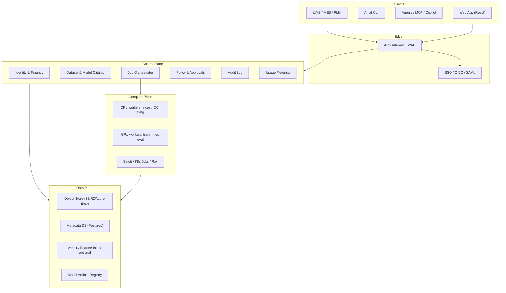
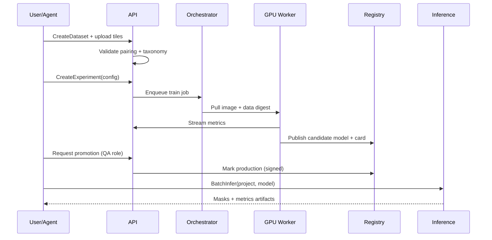

# Amat — Enterprise Microscopy Analysis SaaS

**Status:** Design (pre-implementation)  
**Base capability:** This repo’s Dataset Explorer + MicroNet segmentation pipeline  
**Audience:** Materials labs, aerospace OEMs, semiconductor FA, battery / alloy R&D, contract microscopy houses

---

## 1. Product thesis

Turn the current research monorepo (browse NASA benchmarks → train MicroNet-backed segmenters → inspect IoU / overlays) into a **multi-tenant, enterprise-deployable platform** for production microscopy computer vision:

| Today (repo) | Target (SaaS) |
|---|---|
| Local TIFF folders + Streamlit | Tenant-isolated object storage + web app |
| YAML configs + CLI `train.py` | Job API, queues, GPU pools, experiment registry |
| Single-user results under `results/` | Org workspaces, RBAC, audit trail, signed model artifacts |
| Human-driven notebooks/UI | Agent-native tools, MCP, policy-gated copilots |

**Working name:** **Amat** (Advanced Materials Analysis Technology)  
**Tagline:** Microscopy segmentation that ships into the lab, not just the paper.

---

## 2. Design principles

1. **Domain-first, not dashboard-first** — First screen is the micrograph and the mask, not a KPI grid.
2. **Reproducibility as a product feature** — Every run pins encoder version, seed, data digest, container digest (learn from MicroNet v1.0 vs v1.1 pitfall).
3. **Agent-native by default** — Every user action has an equivalent tool + API; agents never scrape the UI.
4. **Enterprise integration before fancy ML** — SSO, VPC, audit, LIMS hooks land before exotic architectures.
5. **Separation of concerns** — Data plane ≠ control plane ≠ inference plane; Streamlit stays a prototype surface only.

---

## 3. Personas & jobs

| Persona | Primary job | Success signal |
|---|---|---|
| **Materials scientist** | Segment γ′ / oxide / crack; compare models | Trusted overlays + IoU on hold-out |
| **Lab ops engineer** | Ingest instrument dumps; keep queues healthy | SLA on job latency, storage quotas |
| **ML engineer** | Fine-tune encoders; sweep ablations | Experiment matrix with mean±std |
| **QA / metrology** | Approve model for production line | Signed model card + gate checklist |
| **IT / security** | SSO, residency, audit | SOC2 controls map 1:1 to features |
| **Agent / automation** | Run pipelines via tools | Deterministic tool schemas + idempotent jobs |

---

## 4. Platform architecture

### 4.1 Logical planes



### 4.2 Deployment topologies (enterprise-ready)

| Mode | Who runs it | When to use |
|---|---|---|
| **Multi-tenant SaaS** | Amat cloud | Mid-market labs, non-ITAR |
| **Dedicated VPC (BYOC)** | Customer cloud, Amat operators | Large OEMs, data residency |
| **Air-gapped appliance** | Customer only | Defense / classified / no egress |
| **Hybrid** | Control plane SaaS + GPU on-prem | Instruments stay on campus |

**Hard requirement for big enterprise:** same APIs and UI in all modes; only the control-plane trust boundary changes.

### 4.3 Tenancy model

```
Organization
  └── Workspace (lab / program / site)
        ├── Samples (LIMS / pedigree) + Taxonomies
        ├── Projects
        │     ├── DatasetVersions (immutable once ready)
        │     ├── ReviewTasks / Automations
        │     ├── Matrices / Experiments / Runs
        │     ├── Models (draft → candidate → production) + EvidencePack
        │     ├── Inference endpoints / batch jobs
        │     └── Measurements (physical units)
        └── Members + Roles + Agent identities + Notify subscriptions
```

- **Row-level isolation** in Postgres via `org_id` / `workspace_id`.
- **Bucket prefixes or separate buckets** per org; optional CMEK.
- **Agent identities** are first-class principals (not shared service accounts).
- Stress-tested against user stories in §14; gap closures in §15.

---

## 5. Module map

Map from today’s code → SaaS modules.

| Module | Responsibility | Evolves from |
|---|---|---|
| **Ingest & Transfer** | Resumable upload, watch-folder/S3 events, instrument metadata, pairing dry-run | `explorer/lib/{index,catalog,coco,masks}.py` |
| **Samples & Taxonomies** | LIMS sample ids, class schemas, colors/hatch, mask encodings | catalog.json + adapters |
| **Viewer / Annotation** | Overlay workbench, assistive mask correction, CVAT deep-link, review queues | Streamlit Benchmarks / Instance pages |
| **Dataset QC** | Blocking pairing checks, histograms, split imbalance, `ready` gate | `explorer/lib/stats.py`, adapters |
| **Training Studio** | Config-driven train, **Matrix** sweeps, live run telemetry | `src/microscopy_analysis/train/*`, `orchestration/*` |
| **Model Registry** | Weights, cards, encoder pin, dual-control gates, evidence packs | `models/{factory,weights}.py` + checkpoints |
| **Evaluation** | IoU@0.5, frozen eval digest, qualitative panels | `eval/*`, `paper/target_metrics.csv` |
| **Inference & Measurements** | Patch infer (512/256), batch/edge, area/thickness/crack metrics in µm | `eval/predictions.py` |
| **Orchestration** | Queues, cancel/resume, fair-share, automations (non-chat rules) | `orchestration/matrix.py` |
| **Notify** | In-app, email, Slack/Teams; gate/review/job/SLA events | New |
| **Integrations** | REST/gRPC, webhooks, LIMS/MES, SSO | New |
| **Agent Runtime** | MCP tools (incl. ingest + watch_job), policy sandbox, transcripts | New |
| **Admin / Ops / Compliance** | RBAC, audit, quotas, **ops console**, residency, BYOK, classification | New |

### 5.1 Service boundaries (recommended packages)

```
apps/
  web/                 # Enterprise UI (React)
  api/                 # Public HTTP + OpenAPI
  worker-cpu/
  worker-gpu/
  agent-gateway/       # MCP + tool auth
packages/
  domain/              # Datasets, masks, metrics (pure Python — keep from src/)
  ml-runtime/          # torch/smp wrappers
  policy/              # RBAC + approval rules
  sdks/
    python/
    typescript/
infra/
  terraform/
  helm/
```

Keep **domain logic framework-agnostic** so Streamlit can remain a thin internal prototype while the product UI moves to React.

---

## 6. Core domain flows

### 6.1 Ingest → Train → Promote → Infer



### 6.2 Config contract (enterprise-safe evolution of YAML)

Preserve today’s knobs (`encoder`, `architecture`, `pretraining`, `micronet_version`, phase LRs, patience) but store as versioned JSON Schema:

- Immutable `ExperimentSpec` after launch
- `DataDigest` (content-addressed) required before train
- `RuntimeDigest` (container + CUDA/driver) recorded on completion
- Fail closed if `micronet_version != requested`

---

## 7. Enterprise-ready UI

### 7.1 Information architecture

```
Amat
├── Home (workspace continuum — not a KPI dashboard)
├── Library
│   ├── Datasets
│   ├── Images / Tiles
│   └── Taxonomies
├── Studio
│   ├── Annotate / Review
│   ├── Train
│   ├── Experiments
│   └── Compare
├── Models
│   ├── Registry
│   ├── Cards & Gates
│   └── Endpoints
├── Inference
│   ├── Batch jobs
│   └── Live / Edge status
├── Agents
│   ├── Copilot
│   ├── Automations
│   └── Tool activity
└── Admin
    ├── Members & SSO
    ├── Quotas & GPU
    ├── Audit
    └── Integrations
```

### 7.2 Visual system (enterprise, not generic AI chrome)

**Direction:** Industrial-scientific — dark graphite work surface, cool steel accents, micrograph as the hero plane. Avoid purple gradients, cream+serif “AI brochure,” and dashboard card grids in the hero.

| Token | Role |
|---|---|
| `--bg-0` deep graphite `#0E1114` | App chrome |
| `--bg-1` `#161B20` | Panels |
| `--accent` desaturated cyan-steel `#3A8EA8` | Focus / CTA |
| `--warn` amber `#C98A2E` | QC warnings |
| `--mask-a/b/c` class overlay colors (configurable; Super defaults preserved) | Overlays |
| Display font | e.g. **IBM Plex Sans** / **Source Sans 3** (technical, not Inter) |
| Mono | **IBM Plex Mono** for metrics, hashes, digests |

**Motion (2–3 intentional):**
1. Overlay fade/crossfade when toggling prediction vs GT  
2. Tile filmstrip scrub with inertia  
3. Job state pulse only on active compute (not ambient glow spam)

### 7.3 Key screens (composition rules)

**1. Dataset continuum (Home for a project)**  
Full-bleed recent micrograph strip as the visual plane; brand “Amat” as hero mark; one headline (“Ni-superalloy γ′ segmentation”); one CTA (“Open review queue”). No stat strip in first viewport.

**2. Overlay workbench**  
Dominant image canvas edge-to-edge; thin right rail for class legend, opacity, split; filmstrip bottom. Not a card layout.

**3. Experiment compare**  
Side-by-side overlays + linked IoU table; filters for encoder / pretrain / seed. One job: decide which candidate advances.

**4. Model gate**  
Checklist UI for promotion: metrics thresholds, qualitative spot-checks, reproducibility digests, approver signature.

**5. Agent activity**  
Transcript + tool calls with policy outcomes (allowed / denied / needs approval). Same visual language as human audit.

### 7.4 Accessibility & enterprise UX

- Keyboard-first overlay controls (opacity, class solo, next tile)
- Colorblind-safe class palettes with hatch patterns option
- WCAG 2.2 AA on chrome; overlays exempt but legend always text-labeled
- Dense mode for metrology desks; comfortable mode for review meetings

---

## 8. Agent-native capabilities

Agents are a **first-class client**, equal to the web UI.

### 8.1 Principles

1. **Tools, not browsers** — Structured tools with JSON Schema; no DOM automation.
2. **Same authZ as humans** — Agent principal + scoped tokens; tool calls audited.
3. **Human gates for irreversible actions** — Promote-to-production, delete dataset, export raw IP.
4. **Idempotent jobs** — `Idempotency-Key` on train/infer; agents can safely retry.
5. **Typed artifacts** — Tools return URIs + digests, not opaque blobs in chat.

### 8.2 MCP / tool surface (v1)

| Tool | Input | Output | Risk |
|---|---|---|---|
| `list_datasets` | workspace | catalog summary | Low |
| `get_dataset_stats` | dataset_id | splits, class pixels | Low |
| `search_tiles` | filters / text | tile refs | Low |
| `create_experiment` | ExperimentSpec | experiment_id | Medium |
| `start_training` | experiment_id | job_id | Medium |
| `get_run_metrics` | run_id | curves, best IoU | Low |
| `compare_runs` | run_ids[] | table + artifact URIs | Low |
| `request_model_promotion` | model_id, gate | approval ticket | High |
| `run_batch_inference` | model_id, dataset_id | job_id | Medium |
| `export_masks` | job_id, format | signed URL | High |
| `explain_failure` | job_id | diagnosed reason codes | Low |

Expose via:
- **MCP server** (`amat-mcp`) for Cursor / Claude / internal agents  
- **OpenAPI** for traditional automation  
- **Webhook events** (`run.completed`, `gate.approved`, `quota.exceeded`)

### 8.3 Copilot experiences (productized)

| Copilot | Does | Does not |
|---|---|---|
| **Review copilot** | Flags bad masks, suggests tiles to re-label | Auto-commit labels without review mode |
| **Training copilot** | Proposes config from dataset size / classes | Silently change `micronet_version` |
| **Reproduction copilot** | Maps paper claims → runnable matrix | Claim bit-exact CUDA numbers on CPU |
| **Ops copilot** | Explains failed jobs from logs + digests | Restart prod endpoints without approval |

### 8.4 Agent policy engine

```
allow if:
  principal.role in tool.allowed_roles
  AND workspace.quota allows estimated GPU-hours
  AND data.classification <= principal.clearance
  AND (tool.risk != high OR approval.exists)
```

Denied calls return machine-readable `PolicyDenial` so agents can escalate instead of looping.

### 8.5 Agent memory & context packing

- Workspace **system card**: taxonomy, default encoder pin, promotion thresholds  
- Run **lineage graph**: data digest → spec → metrics → model  
- Prefer retrieving digests over pasting images into context; attach thumbnails only when overlay judgment is required

---

## 9. Security, compliance, enterprise integration

### 9.1 Security baseline

- OIDC/SAML SSO, SCIM provisioning  
- RBAC + optional ABAC (site, program, ITAR flag)  
- CMEK / BYOK for object store  
- Signed model artifacts (cosign / in-toto style)  
- Immutable audit log (who/what/when/tool/args hash)  
- Network: private link, IP allowlists, no public buckets by default  
- Secrets: workload identity; never in ExperimentSpec

### 9.2 Compliance map (design targets)

| Control | Product feature |
|---|---|
| Access review | SCIM + role reports |
| Change management | Model promotion gates |
| Data retention | Workspace retention policies |
| Auditability | Append-only audit + agent transcripts |
| Residency | Region-pinned workspaces / air-gap mode |

### 9.3 External systems

| System | Integration |
|---|---|
| LIMS | Push/pull sample IDs; attach mask artifacts to records |
| MES / QMS | Model version used on production lot |
| PLM | Link microstructure findings to part revisions |
| Object storage | Customer-owned buckets (BYOB) |
| IdP | Okta / Entra / Ping |
| SIEM | Audit export (OCSF / JSON) |

---

## 10. API sketch (public)

```
POST   /v1/workspaces/{id}/datasets
POST   /v1/datasets/{id}/uploads
GET    /v1/datasets/{id}/tiles
POST   /v1/experiments
POST   /v1/experiments/{id}/runs
GET    /v1/runs/{id}
GET    /v1/runs/{id}/metrics
POST   /v1/models/{id}/promotion-requests
POST   /v1/inference/batch
GET    /v1/jobs/{id}
GET    /v1/audit/events
```

All responses include `request_id`, resource ETag, and content digests where applicable.

---

## 11. Mapping from current monorepo (migration path)

| Phase | Outcome | Notes |
|---|---|---|
| **M0 — Domain extract** | Adapters, masks, metrics, factory, **calibration helpers** | Already mostly in `src/` + `explorer/lib/` |
| **M1 — Job API + workers** | Upload sessions, QC gate, immutable dataset versions, cancel/events, Matrix | Replaces local `results/`; see G1–G4, G8–G9, G11–G13 |
| **M2 — Web UI v1** | Overlay workbench, review queue, Samples, Notify, ops console | Retire Streamlit as customer face; keep for R&D |
| **M3 — Registry + gates** | Dual-control promotion, evidence pack, measurements | Encoder pin + eval digest mandatory |
| **M4 — Agent/MCP + Automations** | Tool parity incl. ingest/watch; rule engine | Policy + Notify required before high-risk tools |
| **M5 — Enterprise pack** | SSO, VPC, BYOK, classification, LIMS/MES, offline weights | Sales-blocking for Fortune accounts |

Do **not** bolt multi-tenancy onto Streamlit. Treat current apps as capability prototypes.

---

## 12. Non-goals (near term)

- Retraining MicroNet classification on the unreleased ~100k corpus  
- Being a general CV platform (ImageNet zoo without materials semantics)  
- Unrestricted autonomous model promotion  
- Replacing instrument acquisition software

---

## 13. Success metrics

| Metric | Target meaning |
|---|---|
| Time-to-first-segmentation | New tenant → first overlay &lt; 1 hour with sample data |
| Repro integrity | 100% runs record encoder version + data digest |
| Agent autonomy rate | % of train/infer jobs started via tools without UI |
| Gate quality | Production models with complete cards + dual control |
| Enterprise readiness | SSO + audit + VPC path available for design partners |

---

## 14. User stories — design stress test

Stories below are walked against §§4–10. **Pass** = design already covers the path. **Gap** = missing module, API, UI, or policy. Gaps are numbered **G1–G18** and closed or deferred in §15.

### US-1 — Scientist: first proprietary segmentation

> Maya (materials scientist) uploads 40 SEM TIFFs + RGB masks for a new Ni-superalloy heat, trains MicroNet UNet++, reviews overlays, and shares IoU with her PI.

| Step | Design coverage | Verdict |
|---|---|---|
| Create workspace/project | Tenancy model §4.3 | Pass |
| Upload TIFF + masks | Ingest module + `POST .../uploads` | **Gap G1** — no resumable multipart, pairing dry-run, or instrument metadata (µm/px, kV, detector) |
| Validate Super-style `_mask.tif` pairing | Dataset QC module | Pass (concept) — **G2** needs explicit ingest QC job + blocking errors in UI |
| Pick taxonomy / class colors | Library → Taxonomies | **G3** — taxonomy CRUD/API not sketched |
| Train with pinned MicroNet v1.0 | Training Studio + ExperimentSpec | Pass |
| Watch live loss/IoU | “Stream metrics” in sequence | **G4** — no live metrics API / websocket / run timeline UI |
| Overlay pred vs GT | Overlay workbench | Pass |
| Share link with PI | — | **G5** — no share links, comments, or read-only collaborator role |

**Story outcome:** Core ML path works; onboarding friction and collaboration are under-specified.

---

### US-2 — Scientist + reviewer: fix bad labels, retrain safely

> After US-1, Maya finds tertiary γ′ under-labeled on 6 tiles. Chen (senior) reviews, they correct masks, and retrain without silently invalidating the old run’s claims.

| Step | Design coverage | Verdict |
|---|---|---|
| Flag tiles for review | Review copilot “suggests tiles” | **G6** — no review queue entity, assignment, or tile `label_status` |
| Edit masks | Annotate / Review in IA; annotation depth open (§16) | **G7** — must decide: built-in editor vs CVAT; stories need *some* write path in M2 |
| Dataset version bump | “Datasets (versioned)” mentioned once | **G8** — no immutability rules: train must pin `dataset_version`; edits create new version |
| Compare old vs new run on same hold-out | Experiment compare | Pass — **G9** require frozen **eval split digest** so hold-out cannot drift |
| Notify Chen of review request | — | **G10** — no notifications channel (email/Slack/in-app) |

**Story outcome:** Without dataset versioning + review queue, reproducibility principle (§2.2) breaks the moment labels change.

---

### US-3 — ML engineer: ablation matrix like the paper

> Priya launches 7 datasets × 4 pretrains × 2 encoders × 3 seeds, needs mean±std IoU, early-stop of doomed cells, and cost visibility before click.

| Step | Design coverage | Verdict |
|---|---|---|
| Define matrix | Orchestration / `matrix.py` heritage | Pass |
| Enqueue many jobs | Orchestrator + GPU pool | Pass — **G11** missing priority, fair-share, and per-user concurrent-job limits |
| Aggregate mean±std | Eval + compare | **G12** — no `ExperimentMatrix` resource or aggregate metrics API (only single-run) |
| Cancel / partial complete | — | **G13** — no cancel, checkpoint-resume, or matrix cell status API |
| Pre-flight GPU-hour estimate | Policy checks quota | **G14** — quota check exists; no estimate UI/tool or soft-block with FinOps view |
| Reproduce later on different cluster | RuntimeDigest | Pass |

**Story outcome:** Matrix is a first-class product object, not “N times create_experiment.”

---

### US-4 — QA: promote model to the production line

> Omar (metrology) opens a gate checklist, spot-checks overlays, requires dual approval, signs the model card, and records which MES lot may use `model@sha`.

| Step | Design coverage | Verdict |
|---|---|---|
| Gate checklist UI | Model gate screen | Pass |
| Dual control | “approver signature” / high-risk policy | Pass — **G15** specify two distinct humans (or human+break-glass), no self-approve |
| Qualitative spot-check sampling | — | **G16** — no required sample set / stratified tile picker in gate |
| Signed artifact | cosign / in-toto | Pass |
| Push model id to MES/QMS | Integrations table | **G17** — no outbound event payload schema or “production endpoint cutover” flow |
| Audit who approved | Audit log | Pass |
| Generate QA PDF packet | — | **G18** — no report/export package for auditors |

**Story outcome:** Gate UX is right; evidence pack + MES cutover need to be product features, not slideware.

---

### US-5 — Lab ops: overnight instrument dump → morning masks

> A SEM folder sync drops 2k frames at 2am. Ops expects automatic QC, tiling, optional auto-infer with the workspace production model, and a red banner only if SLA breaches.

| Step | Design coverage | Verdict |
|---|---|---|
| Instrument / folder connector | “instrument connectors” one-liner | **Gap** — no watch-folder, S3 event, or transfer appliance design (**folds into G1**) |
| Auto QC + tile | CPU workers | Pass (capability) |
| Auto-infer with prod model | Inference + webhooks | **Gap** — no Automation rules engine beyond Agents page (**G19**) |
| Ops SLA / queue health UI | Lab ops persona success = SLA | **Gap G20** — Admin has Quotas & GPU but no ops queue, lag, failure-rate view |
| Alert on failure | `quota.exceeded` webhook only | **G10** again — need `job.failed`, `sla.breached` |

**Story outcome:** Unattended ingest→infer is a primary enterprise job; “Agents” alone is not an ops automations product.

---

### US-6 — Agent: policy-gated autonomous experiment

> An internal agent (MCP) reads workspace system card, proposes a low-data sweep on Super3-like data, starts training, and must stop when promotion is required.

| Step | Design coverage | Verdict |
|---|---|---|
| Read system card / stats | Tools + memory §8.5 | Pass |
| `create_experiment` + `start_training` | Tool table | Pass |
| Idempotent retry | Idempotency-Key | Pass |
| Hit promote → denial | High risk + PolicyDenial | Pass |
| Open approval ticket for human | `request_model_promotion` | Pass — needs **G10** notify approver |
| Export masks for LIMS | `export_masks` high risk | Pass |
| Upload new data via agent | — | **Gap G21** — no ingest/upload tools (agents blocked at data entry) |
| Subscribe to job events | Webhooks listed | **G22** — no MCP resource subscriptions / long-poll job events for agents |

**Story outcome:** Agent write path is strong for train/infer; weak for ingest and eventing.

---

### US-7 — IT/security: design-win checklist

> Security asks: SSO, SCIM, CMEK, residency in `eu-central`, ITAR workspace, SIEM export, vendor (contract lab) isolation from OEM parent org.

| Step | Design coverage | Verdict |
|---|---|---|
| SSO/SCIM/CMEK/SIEM | §9 | Pass |
| Region pin | Residency | Pass |
| ITAR / clearance ABAC | Mentioned | **G23** — no data classification field on dataset/tile or export firewall rules |
| Vendor org isolation | Multi-tenant | **G24** — no cross-org share / vendor project pattern (data stays in customer org with external IdP guests) |
| Air-gap weight mirror | Air-gap topology | **G25** — MicroNet weights today pull NASA S3; air-gap needs offline weight bundle + license flow |

**Story outcome:** Checkbox security is sketched; classification-aware export and offline weights are real blockers.

---

### US-8 — Metrology: micron-accurate reporting (not just IoU)

> QA needs oxide thickness / phase area fraction in µm², not only pixel IoU, tied to sample ID in LIMS.

| Step | Design coverage | Verdict |
|---|---|---|
| Sample / LIMS ID entity | Only in integrations blurb | **Gap G26** — **Sample** not in domain model |
| Scale calibration (µm/px) | — | **Gap G27** — physical units missing; blockers for enterprise metrology |
| Derived measurements API | — | **Gap G28** — measurement layer (area, thickness, crack length) absent |
| Attach results to LIMS | Integrations | Depends on G26–G28 |

**Story outcome:** Without Samples + calibration + measurements, Amat stays an ML workbench, not a lab system of record.

---

## 15. Gap register & design amendments

| ID | Gap | Severity | Amendment (now part of design) | Phase |
|---|---|---|---|---|
| **G1** | Resumable ingest + instrument metadata | High | Add **Transfer** sub-module: tus/S3 multipart, pairing dry-run API, metadata schema (`µm_per_px`, instrument, operator). Watch-folder / S3 event connectors. | M1 |
| **G2** | Blocking ingest QC in product | High | Every upload spawns `qc` job; dataset cannot enter `ready` until pairing + taxonomy checks pass; UI shows blocking vs warning. | M1 |
| **G3** | Taxonomy CRUD | Medium | `Taxonomy` resource (classes, colors, hatch, mask encoding RGB\|index); referenced by dataset versions. | M1 |
| **G4** | Live run telemetry | High | `GET /runs/{id}/events` (SSE/websocket); Run Timeline UI under Studio. | M1–M2 |
| **G5** | Share & comments | Medium | Read-only share links (time-boxed); tile/thread comments; `viewer` role. | M2 |
| **G6** | Review queue | High | `ReviewTask` on tiles (`unlabeled\|needs_review\|approved`); assignment; queue UI. | M2 |
| **G7** | Annotation write path | High | **Decision:** M2 ships **assistive correction** (brush/polygon on existing masks) + optional CVAT deep-link for heavy labeling; full labeler is M3+ if needed. | M2 |
| **G8** | Dataset immutability | Critical | Dataset versions immutable once `ready`; edits → new version; `ExperimentSpec.dataset_version` required. | M1 |
| **G9** | Frozen eval split | Critical | `EvalSplitDigest` stored on experiment; promotion gate fails if eval data changed. | M1–M3 |
| **G10** | Notifications | High | **Notify** module: in-app + email + Slack/Teams webhooks; events for review, gate, job fail, SLA. | M2 |
| **G11** | Fair-share scheduling | Medium | Queue policies: workspace priority, max concurrent GPUs/user, preemption of interactive vs batch. | M1 |
| **G12** | ExperimentMatrix | High | First-class `Matrix` resource + `GET .../aggregate` (mean±std); Compare UI consumes matrices. | M1–M2 |
| **G13** | Cancel / resume | High | Job `cancel`, `retry`, checkpoint resume token in worker protocol. | M1 |
| **G14** | Cost estimate | Medium | `estimate_train` tool/API → GPU-hours + $; soft-block over quota. FinOps panel under Admin. | M2 |
| **G15** | Dual control rules | High | Policy: promoter ≠ trainer; two distinct approvers for `production`; break-glass audited. | M3 |
| **G16** | Gate sampling | Medium | Gate requires N stratified tiles reviewed (stored as evidence). | M3 |
| **G17** | MES cutover | Medium | `model.promoted` webhook + optional endpoint “pin production revision”; document payload in OpenAPI. | M5 |
| **G18** | Evidence pack | Medium | `GET /models/{id}/evidence-pack.zip` (metrics, overlays, digests, approvals). | M3 |
| **G19** | Automations (non-chat) | High | Rule engine: `on ingest.ready → infer(production_model)`; distinct from Copilot. | M4 |
| **G20** | Ops console | Medium | Admin → **Operations**: queue depth, job lag, failure rate, GPU utilization. | M2 |
| **G21** | Agent ingest tools | Medium | MCP: `create_upload_session`, `complete_upload`, `run_ingest_qc` (policy-gated). | M4 |
| **G22** | Agent job events | Medium | MCP resources or `watch_job` tool; mirror webhook topics. | M4 |
| **G23** | Data classification | High | `classification` on dataset/version (`public\|internal\|confidential\|itar`); export tools respect clearance. | M5 |
| **G24** | External collaborators | Medium | Guest users via IdP; scoped to one project; no cross-tenant data lake. | M5 |
| **G25** | Offline weight bundles | High | Air-gap install includes signed MicroNet weight mirror; workers never call NASA S3. | M5 |
| **G26** | Sample entity | High | `Sample` (LIMS id, pedigree) ↔ tiles; first-class in Library. | M2 |
| **G27** | Calibration | Critical | Per-image or per-dataset `µm_per_px` (and optional affine); required for measurement reports. | M2 |
| **G28** | Measurements | High | Post-infer **Measurement** jobs: area fraction, layer thickness, crack length; stored as typed results. | M3 |

### Amended domain snapshot (after stress test)

```
Organization
  └── Workspace
        ├── Samples ←── LIMS ids
        ├── Taxonomies
        ├── Projects
        │     ├── DatasetVersions (immutable when ready)
        │     ├── ReviewTasks
        │     ├── Matrices / Experiments / Runs
        │     ├── Models (+ EvidencePack)
        │     ├── Automations
        │     └── Measurements
        ├── Notify subscriptions
        └── Ops + Audit
```

### Amended API additions (minimum)

```
POST   /v1/datasets/{id}/upload-sessions          # G1
POST   /v1/datasets/{id}/qc                       # G2
GET    /v1/taxonomies                             # G3
GET    /v1/runs/{id}/events                       # G4 SSE
POST   /v1/tiles/{id}/review-tasks                # G6
POST   /v1/datasets/{id}/versions                 # G8
POST   /v1/matrices                               # G12
POST   /v1/jobs/{id}/cancel                       # G13
POST   /v1/experiments:estimate                   # G14
GET    /v1/models/{id}/evidence-pack              # G18
POST   /v1/automations                            # G19
GET    /v1/ops/queue-stats                        # G20
GET    /v1/samples                                # G26
POST   /v1/inference/{job}/measurements           # G28
```

### Amended MCP tools

| Tool | Closes |
|---|---|
| `create_upload_session` / `complete_upload` / `run_ingest_qc` | G21 |
| `estimate_train` | G14 |
| `create_matrix` / `get_matrix_aggregate` | G12 |
| `cancel_job` / `watch_job` | G13, G22 |
| `list_review_tasks` / `submit_review` | G6 |
| `get_evidence_pack` | G18 |

---

## 16. Open design decisions

1. **Annotation depth** — Resolved for M2: assistive in-app correction + optional CVAT; revisit full labeler after design partners.  
2. **Compute fabric** — K8s Jobs vs Ray vs cloud batch (AWS Batch / Vertex)?  
3. **Edge inference** — Sidecar on SEM PCs vs central batch only for v1?  
4. **Brand lock** — Confirm **Amat** vs product rename before UI implementation.  
5. **Multi-modal later** — EDS/EBSD channels as first-class tensors vs RGB-only v1?  
6. **Measurement pack v1** — Which metrics ship first (area fraction + thickness only vs crack morphometry)?  
7. **Notify providers** — Build in-app+email first, or require customer Slack/Teams from day one?

---

## 17. Recommended next implementation slices

1. Freeze **OpenAPI + ExperimentSpec JSON Schema** including `dataset_version`, `eval_split_digest`, taxonomy ref.  
2. Extract **mask pairing + metrics + calibration** into `amat-domain`.  
3. Stand up **control plane**: dataset versions, QC jobs, upload sessions, job cancel/events.  
4. Ship **overlay workbench + review queue** (React).  
5. Add **Matrix** + aggregate metrics before large GPU spend.  
6. MCP **read + watch_job** tools; defer promote/export until Notify + dual-control exist.  
7. Introduce **Sample + µm/px** before any customer QA pilot (US-8 blocker).

---

*Companion docs:* [PLAN.md](../PLAN.md) (reproduction sprints), [PLAN_DATASET_EXPLORER.md](../PLAN_DATASET_EXPLORER.md) (current explorer). This document supersedes neither; it defines the productization path beyond paper reproduction.
